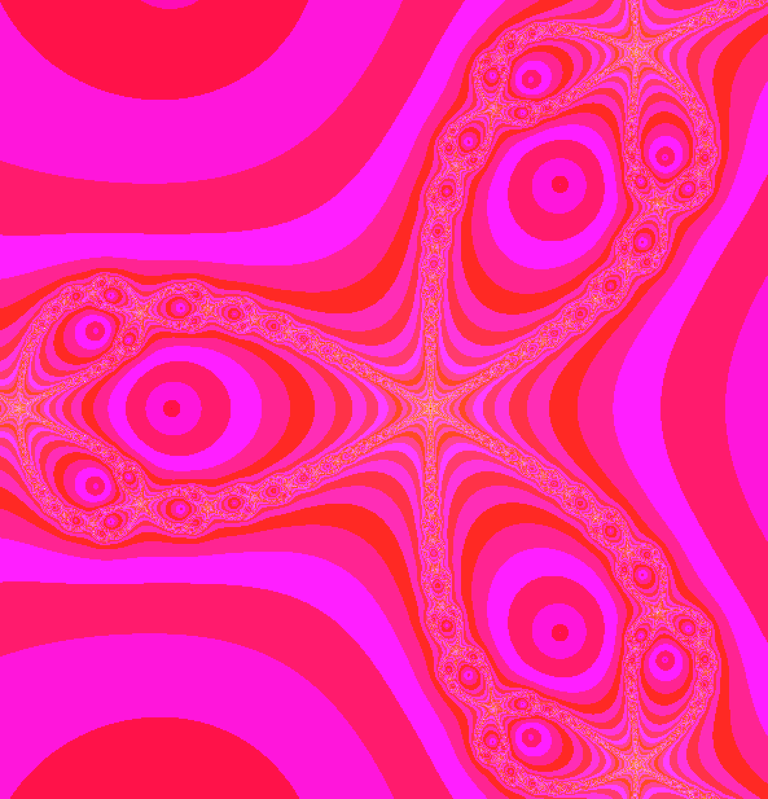

# fractol
A fractal visualizer for Julia, Mandelbrot, and Newton fractals built using C and libmlx (graphics library)

## Demo

Julia Fractal


Mandelbrot Fractal


Newton Fractal



## Installation

This project was build using the El Capitan version of libmlx, so it probably won't work (as in won't compile or just segfault) unless you're running El Capitan on a Mac.

1. Clone the repository or download and extract it.
2. `make`
3. `./fractol Julia`

You can replace `Julia` with `Mandelbrot` or `Newton` as well.

### Controls:
```
SCROLL WHEEL = zoom in/out on the mouse pointer
UP/DOWN ARROW = zoom in/out on the mouse pointer
Z = reset zoom level
+/- = increase/decrease maximum iterations
TAB = show number of maximum iterations and zoom level
ESC = exit

Julia-specific instructions:

CLICK + DRAG = vary julia parameter
SHIFT = lock julia parameter
```
